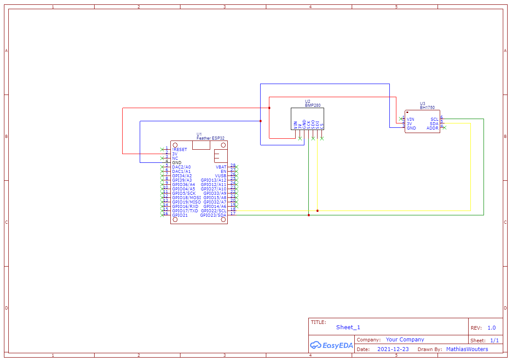

# Weather Station

In the IT Essentials course, I undertook the task of creating a weather station capable of measuring temperature, light intensity, pressure, and altitude. The objective was to collect this data and transmit it to a web page for convenient monitoring and analysis.

**Report:** [Weather Station report](weather_station_report.pdf)

**Video:** [YouTube](https://www.youtube.com/watch?v=zEYegPzMROw%22)

**Completed:** December 2021

## Weather Station

To bring the weather station to life, I opted to utilize an ESP32 board due to its compact size and internet connectivity capabilities. Additionally, I incorporated two Adafruit sensors, namely the BMP280 for measuring pressure and altitude, and the BH1750 for capturing light intensity. With the circuit set up, I initially focused on reading and printing the sensor data on the serial monitor to ensure accurate readings.

Once the data collection was functioning smoothly, I turned my attention to establishing an internet connection for the ESP32 and implementing a web server. Upon successful connection, a message containing the IP address for accessing the web page was printed on the serial monitor. To display the collected data on the web page, I transmitted the HTML code along with the sensor readings to the client's browser. However, I noticed that the data on the web page did not update automatically. To address this, one possible solution would be to incorporate a JavaScript script that refreshes the web page periodically, ensuring real-time updates of the weather data.

The purpose of the Weather Station project in the IT Essentials course was to create a comprehensive weather monitoring system using an ESP32 board and Adafruit sensors. By integrating hardware and programming skills, I successfully developed a functional weather station that collected and transmitted data to a web page. This project provided valuable hands-on experience in hardware integration, web server implementation, and programming, highlighting the potential of combining software and hardware for innovative weather monitoring solutions. It expanded my knowledge and set a strong foundation for future IoT projects. Additionally, this project significantly improved my programming skills in C++, enhancing my ability to create robust and efficient systems. The weather station project can be utilized in various fields that require accurate weather data, such as agriculture, research, and personal weather monitoring.

